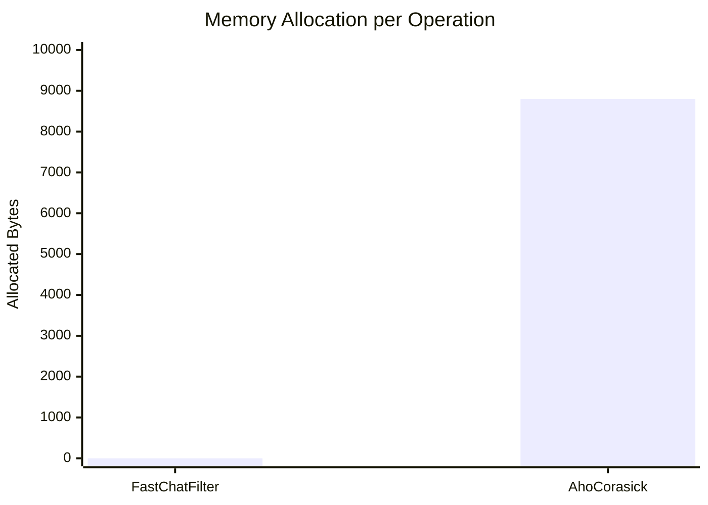
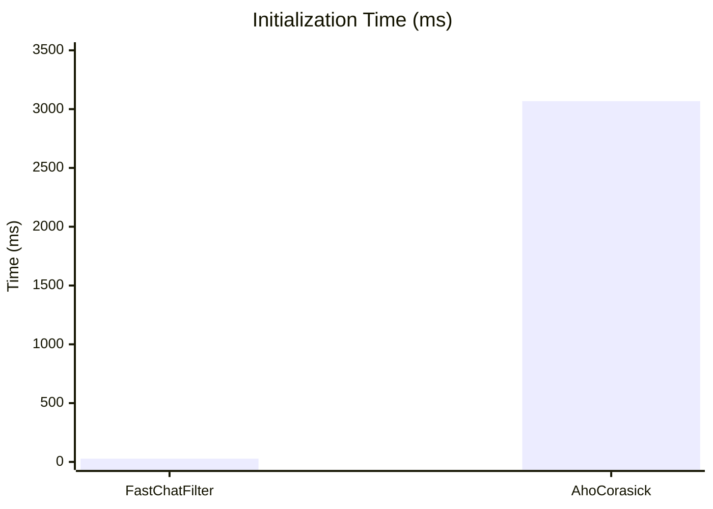
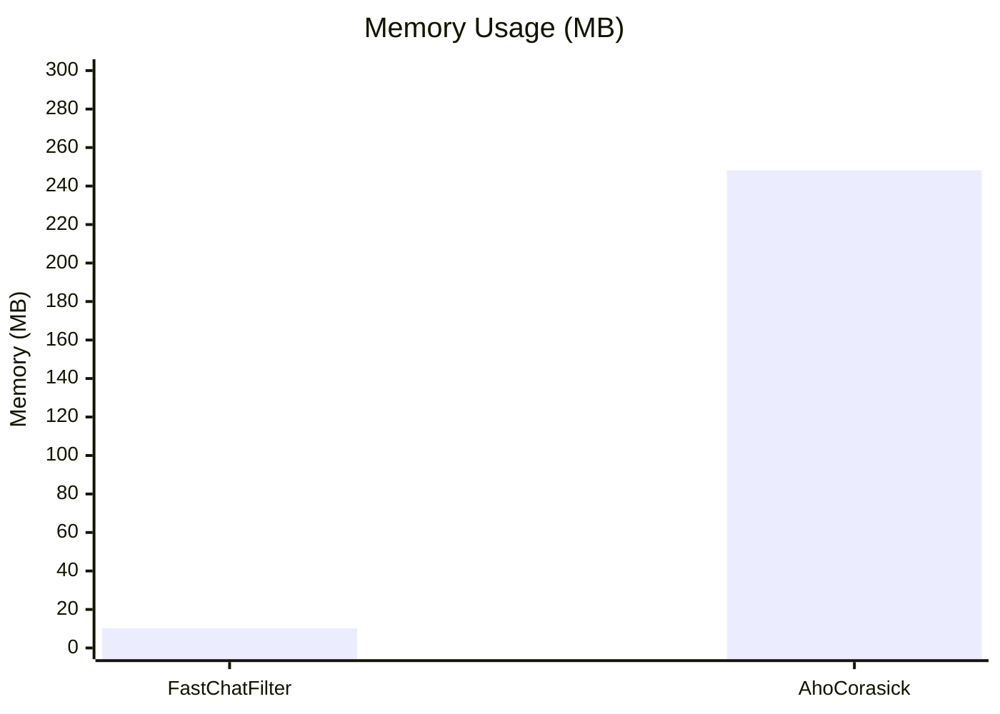

# FastChatFilter

High-performance, zero-allocation profanity filter for .NET. Uses binary trie data structure with Span-based API for maximum performance in game servers, chat systems, and real-time applications.

## Features

- **Zero-allocation hot path**: `Contains()` method allocates zero bytes on the heap
- **Binary Trie**: Precompiled dictionary for O(n) text scanning
- **Span-based API**: Works with `ReadOnlySpan<char>` for maximum flexibility
- **Case-insensitive matching**: Built-in lowercase normalization
- **Multi-target**: Supports .NET 8.0 and .NET Standard 2.1

## Installation

```bash
# Install the runtime library
dotnet add package FastChatFilter

# Install the compiler tool (optional)
dotnet tool install -g FastChatFilter.Compiler
```

## Quick Start

### 1. Create a word list (CSV)

```csv
# badwords.csv
badword
offensive
spam
inappropriate
```

### 2. Compile to binary format

```bash
fcfc -i badwords.csv -o badwords.bin --normalize lower
```

### 3. Use in your application

```csharp
using FastChatFilter;

// Load the compiled dictionary
using var filter = ProfanityFilter.Load("badwords.bin");

// Check for profanity (zero allocation)
bool hasProfanity = filter.Contains(message.AsSpan());

// Mask profanity
string censored = filter.Mask(message, '*');
// "this is badword" -> "this is *******"
```

## API Reference

### ProfanityFilter

```csharp
// Load from file
var filter = ProfanityFilter.Load("words.bin");
var filter = ProfanityFilter.Load("words.bin", new LoadOptions { EnableNormalization = false });

// Load from stream (embedded resources)
var filter = ProfanityFilter.Load(stream);

// Load from byte array
var filter = ProfanityFilter.LoadFromBytes(data);

// Check for profanity
bool contains = filter.Contains("text to check");
bool contains = filter.Contains(text.AsSpan()); // Zero allocation

// Mask profanity
string masked = filter.Mask("bad text", '*');
string masked = filter.Mask("bad text", '#', new MaskOptions { FixedMask = "***" });

// Find all matches
Span<MatchResult> results = stackalloc MatchResult[64];
int count = filter.FindMatches(text.AsSpan(), results);
```

### LoadOptions

```csharp
new LoadOptions
{
    EnableNormalization = true  // Enable case-insensitive matching (default: true)
}
```

### MaskOptions

```csharp
new MaskOptions
{
    PreserveLength = true,  // Replace each character (default: true)
    FixedMask = "***"       // Use fixed replacement string (optional)
}
```

## Compiler CLI

The `fcfc` (FastChatFilter Compiler) tool converts CSV word lists to optimized binary format.

```bash
# Basic usage
fcfc -i words.csv -o words.bin

# With options
fcfc --input words.csv --output words.bin --normalize lower

# Help
fcfc --help
```

### CSV Format

- One word per line
- Comma-separated values supported
- Lines starting with `#` are comments
- Quotes around words are automatically removed

```csv
# Sample word list
badword
offensive, inappropriate, spam
"quoted word"
```

## Performance

### Benchmark Results

Benchmarked against [NReco.Text.AhoCorasickDoubleArrayTrie](https://github.com/nreco/AhoCorasickDoubleArrayTrie) - a highly optimized Aho-Corasick implementation.

**Test Environment:**
- CPU: AMD Ryzen 9 5900X (12 cores, 24 threads)
- Runtime: .NET 8.0.14
- OS: Windows 11

#### Scenario A: Normal Chat (50 chars, 10K patterns)

| Method | Mean | Allocated | GC Pressure |
|--------|------|-----------|-------------|
| **FastChatFilter** | 66.2 μs | **0 B** | None |
| AhoCorasick (NReco) | 11.8 μs | 8,800 B | Gen0: 0.52 |



#### Scenario D: Initialization (100K patterns)

| Metric | FastChatFilter | AhoCorasick | Winner |
|--------|----------------|-------------|--------|
| **Load/Build Time** | 28 ms | 3,068 ms | FastChatFilter (109x faster) |
| **Memory Usage** | 10.17 MB | 248.23 MB | FastChatFilter (24x less) |





#### Key Findings

| Metric | FastChatFilter | AhoCorasick | Analysis |
|--------|----------------|-------------|----------|
| **GC Allocation** | 0 B/op | 8,800 B/op | No GC pauses in hot path |
| **Search Speed** | 66 μs | 12 μs | AC faster due to O(n) complexity |
| **Load Time** | 28 ms | 3,068 ms | Pre-compiled binary advantage |
| **Memory** | 10 MB | 248 MB | Compact binary trie structure |

### When to Choose FastChatFilter

FastChatFilter excels in scenarios where:

- **GC pressure matters**: Game servers, real-time systems where GC pauses are unacceptable
- **Fast startup required**: Serverless functions, microservices with frequent cold starts
- **Memory constrained**: Edge devices, containerized environments
- **Predictable latency**: P99 latency requirements where GC spikes are problematic

### Performance Targets

| Metric | Target | Achieved |
|--------|--------|----------|
| Contains allocation | 0 bytes | 0 bytes |
| Load time (100K words) | <50ms | 28ms |
| Binary size (100K words) | <10MB | 9.78MB |

## Integration Examples

### ASP.NET Core Middleware

```csharp
public class ProfanityMiddleware
{
    private readonly RequestDelegate _next;
    private readonly ProfanityFilter _filter;

    public ProfanityMiddleware(RequestDelegate next, ProfanityFilter filter)
    {
        _next = next;
        _filter = filter;
    }

    public async Task InvokeAsync(HttpContext context)
    {
        // Check request body for profanity...
        await _next(context);
    }
}

// In Program.cs
builder.Services.AddSingleton(_ => ProfanityFilter.Load("words.bin"));
```

### Game Server

```csharp
public class ChatHandler
{
    private readonly ProfanityFilter _filter;

    public ChatMessage ProcessMessage(string text)
    {
        if (_filter.Contains(text.AsSpan()))
        {
            return new ChatMessage { Text = _filter.Mask(text), IsCensored = true };
        }
        return new ChatMessage { Text = text };
    }
}
```

## License

MIT License

## Contributing

Contributions are welcome! Please feel free to submit a Pull Request.
